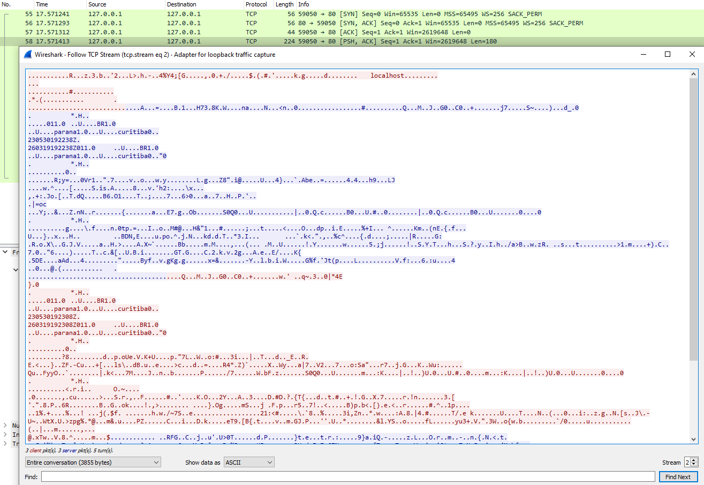
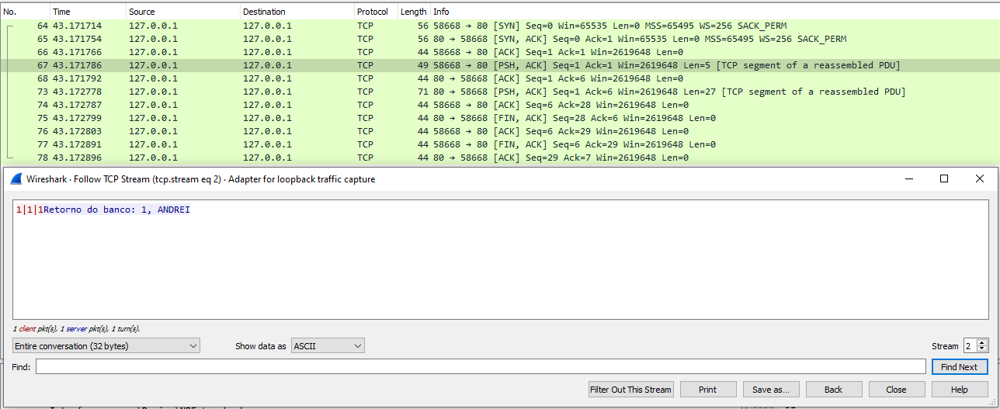
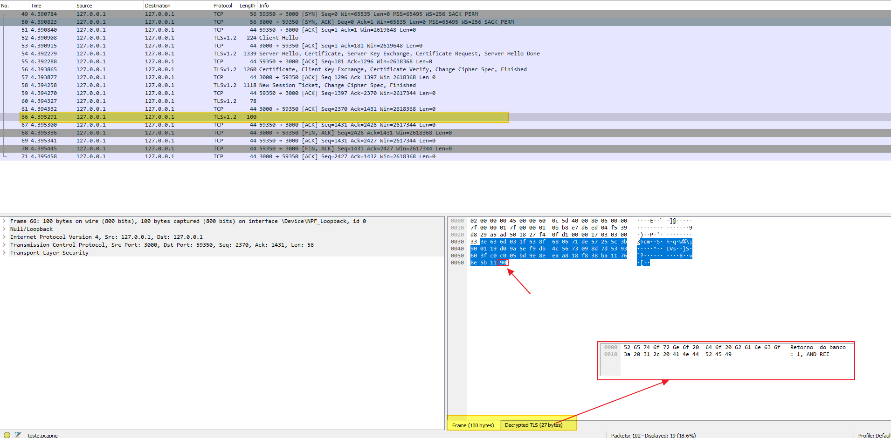
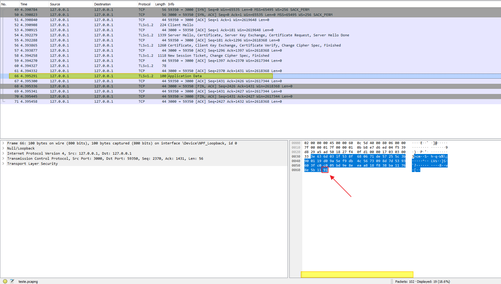

# Relatório do trabalho prático de Tópicos em Redes - Cliente-Servidor KVS seguro com TLS
### Autores: Andrei Alisson Ferreira Julio e João Pedro Kieras Oliveira

## Overview
O trabalho foi implementado inteiramente em linguagem Python. São dois arquivos fonte: client.py e server.py .
Para executar os mesmos, basta:
```
$ python3 client.py
```
```
$ python3 server.py
```


### Funcionamento do banco de dados

Para a parte dos dados KV (Key-Value) no sistema, utilizamos um banco de dados relacional PostgreSQL. O programa cria uma pequena base de dados, e uma tabela `{chave (INTEGER), valor (STRING)}` contendo os dados iniciais  `{1, 'ANDREI'; 2, 'JOAO'} `, sendo a chave uma PK (Primary-Key).

Após executa os programas, o programa do cliente dá ao usuário 5 opções de input, sendo elas:
```
1-Select, 2-Insert, 3-Update, 4-Delete, 5-Exit:
```
`1-Select:` Realiza uma consulta de dados, podendo ser por `1-Chave, 2-Valor`. A consulta por valor retorna padrões de string (utilizando o comando ILIKE do psql), fazendo com que possa ser retornado várias rows contendo dados.
`2-Insert:` Realiza uma inclusão de dados, digitando os dados de `Chave` e `Valor`, respeitando a propriedade PK do campo Chave.
`3-Update:` Realiza uma alteração de dados, digitando os dados de `Chave` e o novo `Valor` que será atualizado no banco de dados.
`4-Delete:` Realiza uma exclusão de dados, digitando os dados de `Chave` apenas para ser excluído.

O cliente então envia uma sequência de dados concatenados pela string "|", e o servidor processa essa sequência sabendo o que foi pedido pelo cliente, e então retorna os dados obtidos da consulta (para a consulta), ou retorna uma mensagem de sucesso (para Inclusão/Alteração/Exclusão). Caso haja algum erro, é retornado para o cliente uma mensagem contendo o erro.


### Funcionamento do TLS

Antecipando um pouco do que veremos adiante, a parte da criação de certificados é muito importante neste trabalho pois é com base nos certificados criados que a conexão segura é estabelecida.
Utilizamos os seguintes comandos para criar os certificados tanto para o servidor quanto para o cliente:
```
openssl req -x509 -sha256 -newkey rsa:2048 -keyout certificate-server.key -out certificate-server.crt -days 1024 -nodes
```
```
openssl req -x509 -sha256 -newkey rsa:2048 -keyout certificate-client.key -out certificate-client.crt -days 1024 -nodes
```

Explicando um pouco do que foi feito para criarmos a conexão segura com TLS:
Primeiro, criamos um contexto TLS usando o protocolo 1.2
```
context = ssl.SSLContext(ssl.PROTOCOL_TLSv1_2)
```
Agora, sempre que criarmos uma conexão será verificado se a outra parte comunicante possui um certificado
```
context.verify_mode = ssl.CERT_REQUIRED
```
Então, carregamos o certificado da outra parte comunicante (se estivermos editando o client.py carregamos o certificado do servidor, se estivermos em server.py carregamos o certificado do cliente)
```
context.load_verify_locations(cafile='certificados/certificado_cliente_ou_servidor.crt')
```
Neste ponto carregamos nosso próprio certificado juntamente com nossa chave privada (as variáveis contém o path para os arquivos de certificado e chave privada)
```
context.load_cert_chain(certfile=cert_file, keyfile=key_file)
```
Se estivéssemos falando de programas executando no ambiente de produção de uma empresa, precisaríamos de uma terceira entidade na comunicação que faria a criação e autenticação destes certificados. Contudo, para fins didáticos e práticos, estamos utilizando certificados autoassinados para este trabalho.

Agora, falando um pouco sobre o socket, criamos a camada de segurança utilizando aquele contexto criado anteriormente e passamos como parâmetro nosso próprio socket e o IP destino:
```
secure_socket = context.wrap_socket(nosso_socket, server_hostname=target_ip)
```

E então, fazemos a conexão e enviamos uma mensagem utilizando como parâmetros o IP e porta do destino:
```
secure_socket.connect((target_ip, target_port))
secure_socket.send(...)
```

## Testes de Sigilo/Autenticidade/Integridade

Na hora que vamos criar um certificado são feitas uma série de perguntas para garantir uma certa legitimidade do mesmo. Quando criamos os certificados para este trabalho foram perguntadas coisas como "Qual o seu país?" "Qual seu estado?" e "Qual sua cidade?" dentre muitas outras. Respondemos as perguntas com "BR", "parana" e "curitiba" respectivamente.
É possível ver no payload dos pacotes essas informações do certificado, assim, a comunicação de fato usa essa ferramenta de segurança e conseguimos ver também que toda a informação está cifrada.

#### Autenticidade

Para simular uma tentativa de ataque ao sistema podemos utilizar como base o próprio programa client.py alterando o certificado e a chave privada. Um atacante, por mais que soubesse o endereço IP do servidor e as portas utilizadas, muito dificilmente teria acesso aos certificados usados na comunicação pois essa parte é feito por uma organização terceira. Ao tentar utilizar um certificado e chave privada diferente do que o servidor aceita e conhece, obtemos o seguinte erro (por parte do servidor) ao tentar executar o programa:

```bash
ssl.SSLCertVerificationError: [SSL: CERTIFICATE_VERIFY_FAILED] certificate verify failed: self signed certificate (_ssl.c:1131)
```

O erro também ocorre caso o atacante tente se passar como servidor para enganar o cliente, o cliente verifica o certificado e, ao perceber que é diferente do certificado do servidor, nega a conexão.

Comprovando, assim, que a comunicação é de fato segura e garante `autenticidade`.

#### Sigilo

Para garantir o sigilo podemos observar pelo Wireshark os pacotes que foram transmitidos durante a conexão. O protocolo SSL criptografa automaticamente as mensagens, então ao tentar interceptá-las, se o atacante não tiver a chave, então ele terá acesso apenas a uma sequência da caracteres sem sentido. A imagem abaixo mostra um exemplo de uma mensagem padrão interceptada utilizando o protocolo SSL com criptografia



Foram também realizados testes utilizando uma comunicação SEM o protocolo SSL, e foi observado que é possível interceptar as mensagens trocadas entre a comunicação do cliente/servidor abertamente, conforme mostra a imagem abaixo, provando o `sigilo` do sistema.



#### Integridade

Para provar a integridade, foram feitos testes utilizando o Wireshark novamente.

O programa server.py foi configurado pra importar um arquivo `./logs/keylog.log` contendo a chave TLS utilizada na comunicação. Este arquivo foi importado no programa Wireshark para a visualização das mensagens.

Foi então salvo o arquivo da comunicação entre o cliente e servidor, no formato do próprio Wireshark (.pcapng). Este arquivo foi adulterado manualmente, alterando um bit hexadecimal da mensagem de retorno.

As imagens abaixo mostram os testes realizados, a primeira contendo o arquivo correto sem adulterar, e a segunda, trocando o hexa de valor `90` para o valor `91`. O resultado foi que o programa não conseguiu descriptografar a mensagem de retorno. Isso prova que o sistema possui `integridade` e não é possível alterar a mensagem no meio da comunicação (Utilizando ataques como Man in the Middle).






## Conclusão

Concluímos este trabalho com o aprendizado de como implementar um sistema simples de cliente/servidor de maneira segura atreavés do TLS, de forma que ataques comuns realizados possam ser evitados, mantendo a comunicação segura e consistente.